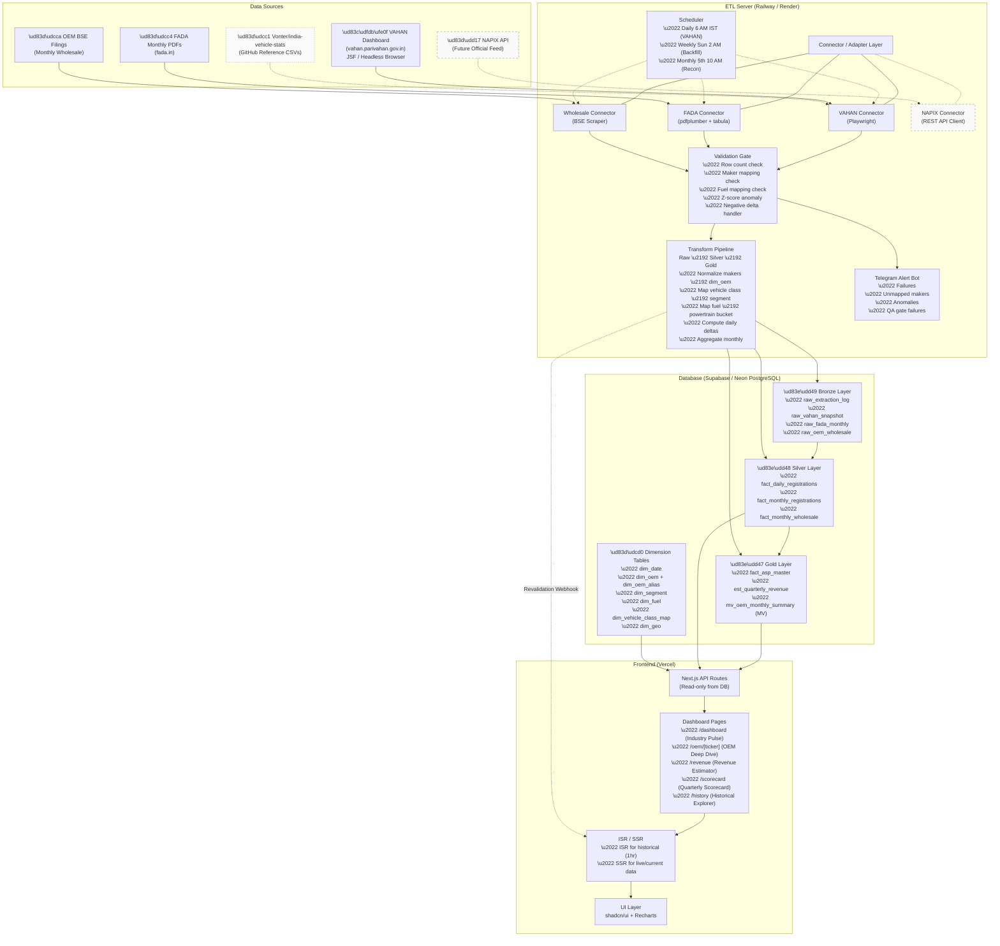

# AutoQuant — System Architecture

## Architecture Diagram (Mermaid.js)



## Data Flow Summary

```
VAHAN Dashboard ──→ Playwright Connector ──→ Validation Gate ──→ Transform Pipeline
                                                    │                     │
                                              (FAIL → Telegram)     ┌─────┴─────┐
                                                                    ▼           ▼
                                                              Bronze Tables  Silver Tables
                                                                               │
                                                                               ▼
                                                                         Gold Tables
                                                                               │
                                                                               ▼
                                                                   Materialized Views
                                                                               │
                                                              (ISR Revalidation Webhook)
                                                                               │
                                                                               ▼
                                                                    Next.js API Routes
                                                                               │
                                                                               ▼
                                                                    Vercel Dashboard UI
```

## Connector / Adapter Pattern

All data source connectors implement a common `BaseConnector` interface:

```
┌─────────────────────────────────────────────────────┐
│                 BaseConnector (ABC)                   │
│                                                       │
│  + extract(params: ExtractParams) → RawData           │
│  + validate(data: RawData) → ValidationResult         │
│  + get_source_name() → str                            │
│  + health_check() → bool                              │
└───────────────────────────┬───────────────────────────┘
            ┌───────────────┼───────────────┬──────────────────┐
            ▼               ▼               ▼                  ▼
   VahanConnector    FadaConnector   WholesaleConnector   NapixConnector
   (Playwright)      (pdfplumber)    (BSE Scraper)        (REST API)
                                                          [Future]
```

This pattern ensures VAHAN scraper can be swapped for NAPIX API feed
without touching warehouse, transforms, or frontend.
